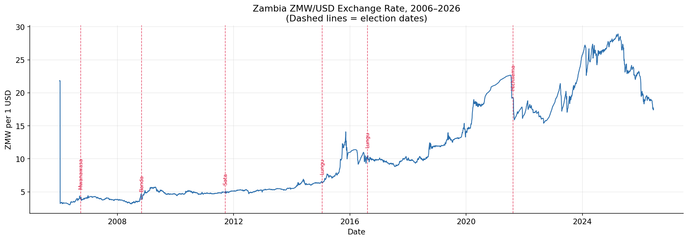
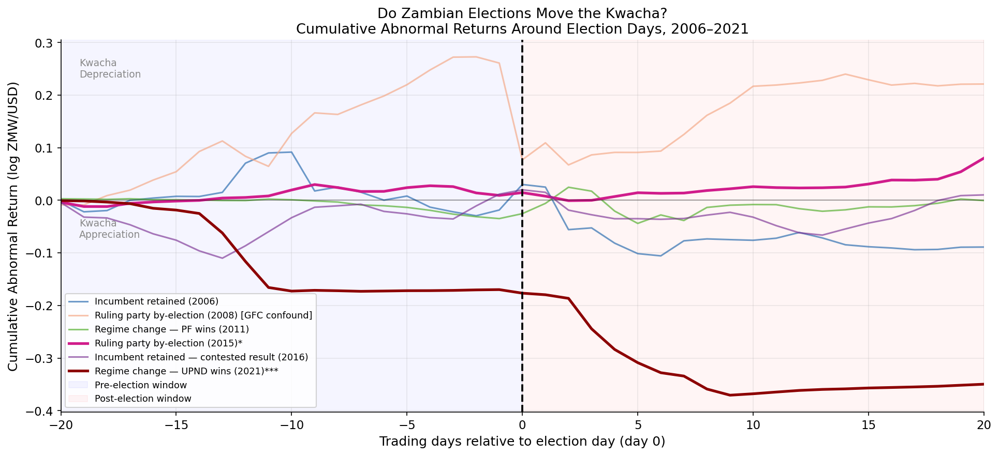
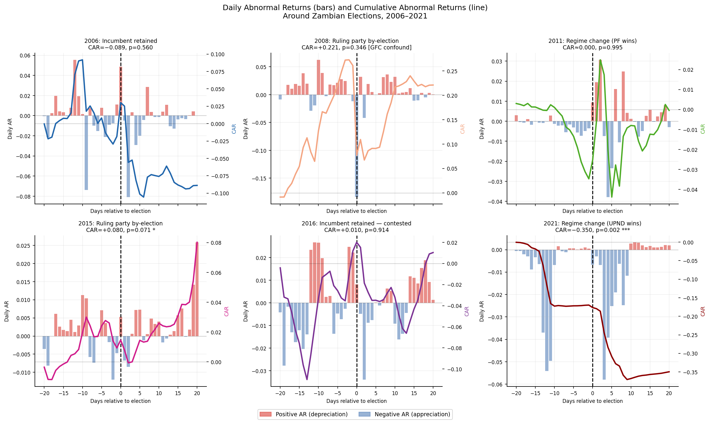
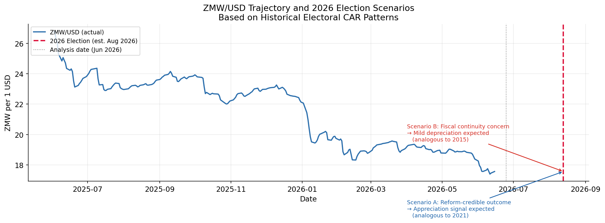

# Do Zambian Elections Move the Kwacha?
**An Event-Study Analysis of Electoral FX Effects, 2006–2021**

*Boldwin Mweemba -Data Analyst, Lusaka | MScFE candidate, WorldQuant University*

---

Zambia holds general elections every five years. This project asks a simple question: does the market care?

Using daily Bank of Zambia interbank rates from 2006 to 2026, I apply a standard event-study framework to six electoral events — computing Cumulative Abnormal Returns (CARs) over a ±20 trading day window around each election date. The short answer: the Kwacha mostly ignores elections. Except once.

---

## The Main Finding

The 2021 regime-change election produced a **35% log-scale Kwacha appreciation** — strongly significant (p = 0.002) - that began building **two weeks before polling day**. No other election in the sample came close.

This points to a **credibility hypothesis**: the Kwacha does not respond to electoral uncertainty per se. It responds when an election plausibly changes the fiscal and reform trajectory. Three elections produced no signal at all. One was confounded by the 2008 global financial crisis. One (2015) produced marginal post-result depreciation consistent with markets beginning to price in sovereign fiscal risk.

| Year | Type | CAR | p-value |
|------|------|-----|---------|
| 2006 | General | −0.089 | 0.560 |
| 2008 | By-election | +0.221 | 0.346 |
| 2011 | General — regime change | ≈0.000 | 0.995 |
| 2015 | By-election | +0.080 | 0.071 * |
| 2016 | General | +0.010 | 0.914 |
| 2021 | General — regime change | **−0.350** | **0.002 ***|

*Negative CAR = Kwacha appreciation (fewer ZMW per USD)*

---

## Figures

**Figure 1 - ZMW/USD Exchange Rate, 2006–2026**

*Full daily rate series with election dates marked. Pre-2013 values adjusted for the currency redenomination (1 new Kwacha = 1,000 old Kwacha).*

**Figure 2 - Cumulative Abnormal Returns, All Elections Overlaid**

*The 2021 event window stands apart from the rest of the sample in both magnitude and direction.*

**Figure 3 - Daily AR and CAR by Election (Six-Panel)**

*Individual election panels showing the pre- vs post-result timing of each signal.*

**Figure 4 - 2026 Forward Assessment**

*Current ZMW/USD trajectory with the August 2026 election marked and scenario bands from the historical CAR distribution.*

---

## Methodology in Brief

- **Data:** BoZ daily interbank midrate, 3 Jan 2006 – Jun 2026 (5,074 trading days)
- **Estimation window:** Days −120 to −21 before election day (~100 days)
- **Event window:** Days −20 to +20 (41 trading days)
- **Normal return:** Mean log return over the estimation window
- **Inference:** t-statistic on the full-window CAR; p-values from t-distribution (N−1 df)

This directly extends [Mweemba (2026)](https://github.com/BoldwinMax/zambia-exchange-rate-forecasting), which found FX reserves explain ~50% of Kwacha movements. This paper asks whether the residual is partly explained by electoral signals.

---

## Abbreviations

| | |
|---|---|
| AR | Abnormal Return |
| BoZ | Bank of Zambia |
| CAR | Cumulative Abnormal Return |
| FX | Foreign Exchange |
| GFC | Global Financial Crisis |
| IMF | International Monetary Fund |
| MMD | Movement for Multi-party Democracy |
| NAPSA | National Pension Scheme Authority |
| PF | Patriotic Front |
| UPND | United Party for National Development |
| USD | United States Dollar |
| ZMW | Zambian Kwacha (ISO 4217) |

---

## Related Work

| Project | Description |
|---|---|
| [Zambia Exchange Rate Forecasting](https://github.com/BoldwinMax/zambia-exchange-rate-forecasting) | ZMW/USD trend decomposition and quantile forecasting; reserves as the dominant driver |
| [Zambia Energy Security Risk Model](https://github.com/BoldwinMax/Zambia-Energy-Security-Risk-Model) | Kariba levels, El Niño cycles, and load-shedding risk (2000–2025) |

---

## Data Sources

- Bank of Zambia — Daily Average Interbank Exchange Rates: https://www.boz.zm
- Electoral Commission of Zambia — Results Archive: https://www.elections.org.zm
- MacKinlay, A.C. (1997). Event Studies in Economics and Finance. *Journal of Economic Literature*, 35(1), 13–39.
